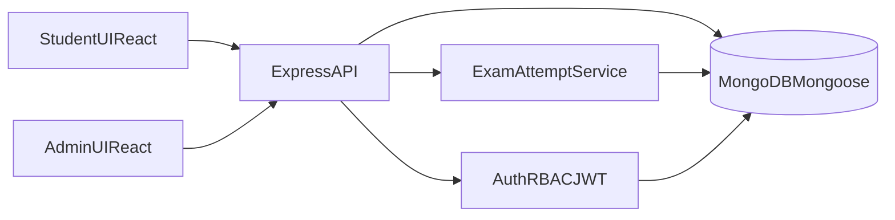

# SSC CBT Application Implementation Plan

## Assumptions

- Monorepo structure: `frontend/` + `backend/`.
- Frontend state management: Redux Toolkit (exam runtime state, autosave queue, timer).
- JWT access token + refresh token strategy, role-based authorization middleware.
- Exam attempt integrity is enforced server-side (score calculation, question randomization, final evaluation).

## High-Level Architecture

## Phase 1: Repository Foundation

- Create monorepo folders and baseline docs:
  - [backend/package.json](backend/package.json)
  - [backend/src/server.js](backend/src/server.js)
  - [frontend/package.json](frontend/package.json)
  - [frontend/src/main.jsx](frontend/src/main.jsx)
  - [README.md](README.md)
- Add environment templates:
  - [backend/.env.example](backend/.env.example)
  - [frontend/.env.example](frontend/.env.example)
- Configure quality/tooling:
  - ESLint + Prettier + scripts for dev/build/test/start.

## Phase 2: Backend Core (Express + Mongoose)

- Create scalable backend layering:
  - [backend/src/config/db.js](backend/src/config/db.js)
  - [backend/src/config/env.js](backend/src/config/env.js)
  - [backend/src/app.js](backend/src/app.js)
  - [backend/src/routes/index.js](backend/src/routes/index.js)
  - [backend/src/middlewares/errorHandler.js](backend/src/middlewares/errorHandler.js)
  - [backend/src/middlewares/authMiddleware.js](backend/src/middlewares/authMiddleware.js)
  - [backend/src/middlewares/roleMiddleware.js](backend/src/middlewares/roleMiddleware.js)
  - [backend/src/utils/ApiError.js](backend/src/utils/ApiError.js)
- Add secure defaults:
  - `helmet`, `cors`, `express-rate-limit`, request validation, centralized error handling.

## Phase 3: Mongoose Schema Design (Critical)

- Implement required models with indexes and constraints:
  - [backend/src/models/User.js](backend/src/models/User.js)
  - [backend/src/models/Question.js](backend/src/models/Question.js)
  - [backend/src/models/Exam.js](backend/src/models/Exam.js)
  - [backend/src/models/Attempt.js](backend/src/models/Attempt.js)
- Key design decisions:
  - `User`: unique email index, hashed password (`bcrypt`), role enum, block flag.
  - `Question`: options subdocument with `text` and `isCorrect`, category/difficulty indexing.
  - `Exam`: category filters + marking config (marksPerQuestion, negativeMarks).
  - `Attempt`: persistent question snapshot per attempt (questionId + shuffled options map + answer state + timeSpent) to support resume, anti-tampering, and deterministic scoring.

## Phase 4: Auth + RBAC APIs

- Implement auth endpoints and services:
  - [backend/src/routes/authRoutes.js](backend/src/routes/authRoutes.js)
  - [backend/src/controllers/authController.js](backend/src/controllers/authController.js)
  - [backend/src/services/authService.js](backend/src/services/authService.js)
- Endpoints:
  - `POST /api/auth/register`
  - `POST /api/auth/login`
- Add JWT verification and role guards for admin-only routes.

## Phase 5: Admin APIs (Questions, Exams, Users)

- Questions CRUD:
  - [backend/src/routes/questionRoutes.js](backend/src/routes/questionRoutes.js)
  - [backend/src/controllers/questionController.js](backend/src/controllers/questionController.js)
- Exam management:
  - [backend/src/routes/examRoutes.js](backend/src/routes/examRoutes.js)
  - [backend/src/controllers/examController.js](backend/src/controllers/examController.js)
- User management:
  - [backend/src/routes/userRoutes.js](backend/src/routes/userRoutes.js)
  - [backend/src/controllers/userController.js](backend/src/controllers/userController.js)
- Enforce admin access for create/update/delete and block/unblock flows.

## Phase 6: Exam Runtime + Attempt Engine

- Implement candidate exam flow:
  - [backend/src/routes/attemptRoutes.js](backend/src/routes/attemptRoutes.js)
  - [backend/src/controllers/attemptController.js](backend/src/controllers/attemptController.js)
  - [backend/src/services/attemptService.js](backend/src/services/attemptService.js)
- Core endpoints:
  - `GET /api/exams`
  - `GET /api/exam/:id/start`
  - `POST /api/attempt/start`
  - `POST /api/attempt/save`
  - `POST /api/attempt/submit`
- Runtime behavior:
  - Randomize question set per user from exam categories.
  - Shuffle options and persist order in attempt snapshot.
  - Autosave answer/update timers.
  - Resume in-progress attempt.
  - Auto-submit when timer expires.
  - Score formula: `+2` correct, `-0.5` wrong (or exam-config values).

## Phase 7: Frontend App Shell (React + Tailwind + Redux Toolkit)

- Setup UI architecture:
  - [frontend/src/app/store.js](frontend/src/app/store.js)
  - [frontend/src/app/providers.jsx](frontend/src/app/providers.jsx)
  - [frontend/src/routes/AppRouter.jsx](frontend/src/routes/AppRouter.jsx)
  - [frontend/src/api/client.js](frontend/src/api/client.js)
  - [frontend/src/features/auth/authSlice.js](frontend/src/features/auth/authSlice.js)
  - [frontend/src/features/exam/examSlice.js](frontend/src/features/exam/examSlice.js)
- Build reusable layout/components:
  - [frontend/src/components/layout/DashboardLayout.jsx](frontend/src/components/layout/DashboardLayout.jsx)
  - [frontend/src/components/common/ProtectedRoute.jsx](frontend/src/components/common/ProtectedRoute.jsx)
  - [frontend/src/components/common/LoadingSpinner.jsx](frontend/src/components/common/LoadingSpinner.jsx)
  - [frontend/src/components/common/ErrorState.jsx](frontend/src/components/common/ErrorState.jsx)

## Phase 8: Student Experience (SSC-style CBT)

- Student pages:
  - [frontend/src/pages/student/StudentDashboard.jsx](frontend/src/pages/student/StudentDashboard.jsx)
  - [frontend/src/pages/student/ExamInstructions.jsx](frontend/src/pages/student/ExamInstructions.jsx)
  - [frontend/src/pages/student/ExamPage.jsx](frontend/src/pages/student/ExamPage.jsx)
  - [frontend/src/pages/student/ResultPage.jsx](frontend/src/pages/student/ResultPage.jsx)
- Exam UI components:
  - [frontend/src/components/exam/QuestionPanel.jsx](frontend/src/components/exam/QuestionPanel.jsx)
  - [frontend/src/components/exam/OptionList.jsx](frontend/src/components/exam/OptionList.jsx)
  - [frontend/src/components/exam/QuestionNavigator.jsx](frontend/src/components/exam/QuestionNavigator.jsx)
  - [frontend/src/components/exam/ExamActions.jsx](frontend/src/components/exam/ExamActions.jsx)
  - [frontend/src/components/exam/SubmitConfirmModal.jsx](frontend/src/components/exam/SubmitConfirmModal.jsx)
- Implement required controls:
  - Save & Next, Mark for Review, Clear Response, Prev/Next, jump navigation.
  - Color states: answered, not answered, marked for review.
  - Countdown timer + warning thresholds + auto-submit.
  - Tab-switch detection banner and counter (basic anti-cheating).

## Phase 9: Admin Panel Experience

- Admin pages:
  - [frontend/src/pages/admin/AdminDashboard.jsx](frontend/src/pages/admin/AdminDashboard.jsx)
  - [frontend/src/pages/admin/QuestionManager.jsx](frontend/src/pages/admin/QuestionManager.jsx)
  - [frontend/src/pages/admin/ExamManager.jsx](frontend/src/pages/admin/ExamManager.jsx)
  - [frontend/src/pages/admin/UserManager.jsx](frontend/src/pages/admin/UserManager.jsx)
- Provide complete CRUD flows with validations, table views, filters, and status toasts.

## Phase 10: Analytics, Quality, and Hardening

- Student analytics:
  - Attempt history, score trend, correctness breakdown, section-wise stats, time spent summary.
- Backend hardening:
  - Input validation (`zod`/`joi`), pagination, query sanitization, structured logging.
- Testing:
  - Backend integration tests for auth/exam/attempt scoring.
  - Frontend unit tests for exam state transitions and timer behavior.

## Phase 11: Seed Data and Developer Experience

- Add seed scripts:
  - [backend/src/seeds/questions.seed.js](backend/src/seeds/questions.seed.js)
  - [backend/src/seeds/admin.seed.js](backend/src/seeds/admin.seed.js)
- Add scripts in [backend/package.json](backend/package.json) for seeding and reset.
- Document local run workflow in [README.md](README.md).

## Phase 12: Deployment and Operations

- Frontend deployment:
  - Vercel project with environment variables and API base URL setup.
- Backend deployment:
  - Render or Railway service, MongoDB Atlas connection, JWT secrets, CORS origins.
- Add production docs:
  - [docs/deployment.md](docs/deployment.md)
  - [docs/api.md](docs/api.md)
  - [docs/architecture.md](docs/architecture.md)
- Optional CI:
  - [/.github/workflows/ci.yml](.github/workflows/ci.yml) for lint/test/build checks.

## Deliverables Mapping to Your Request

- Complete backend with Express, MongoDB, JWT, RBAC.
- All required Mongoose models and API endpoints.
- Complete frontend with modern SSC-like exam runtime UI.
- Seed scripts, instruction page, loading/error states.
- Integration and deployment guides for Vercel + Render/Railway.

